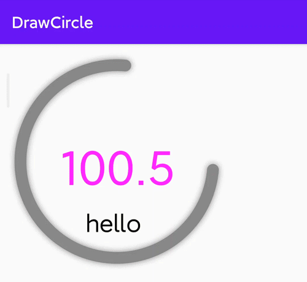

### 一种自定义的环状进度条。

```
1. 支持自定义起始和终止角度
2. 支持多渐变色定义当前环位置
3. 支持自定义标题样式
4. 支持layout.xml实时查看环
5. 支持动画数值展示
```



### TODO:
- [ ] 添加起始终止刻度与数值
- [ ] 渐变色默认会环绕360度而不是按照实际总角度换算
- [ ] xml可以自定义渐变色
- [ ] xml的curAngle需要在startAngel=0时才能生效
